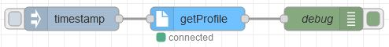
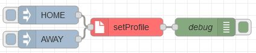

# @mobsean/node-red-contrib-vallox-api

Integrate [Vallox](https://vallox.com/) ventilation units in your home automation project using [node-red](https://nodered.org).

This uses the build-in Vallox webserver to get and set properties of your HVAC. 

## Nodes

1. **get Profile**: Returns the current profile of the vallox unit.

2. **set Profile**: Sets the current vallox profile.

3. **get Temp**: Returns all current temperatures of the vallox unit.


## ideas

- [ ] read next filter change
- [ ] setValue

```js
await client.setValues({
  'A_CYC_HOME_SPEED_SETTING': 60
})
```

- [ ] read humidity sensor
- [ ] read co2 sensor

## tested with

- ValloPlus 240-E MV, Ver. 2.0.12


## thanks to
- [@danielbayerlein](https://github.com/danielbayerlein/vallox-api) for the vallox-api project
- [@torbenledermann](https://www.youtube.com/@torbenledermann) for his consice node-red videos using KNX
